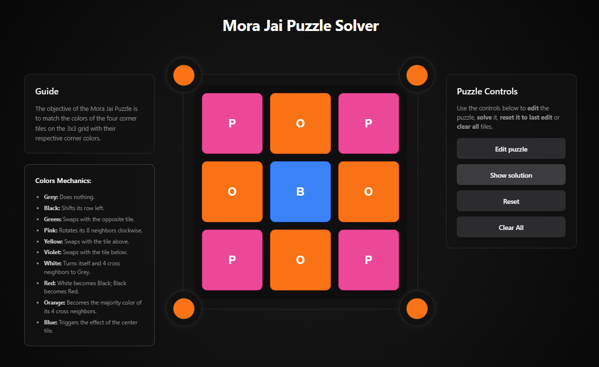

# 🧩 Mora Jai Puzzle Solver

A web-based, high-performance solver for the Mora Jai puzzles from the game **[Blue Prince](https://store.steampowered.com/app/1528630/Blue_Prince/)**.

---

_A preview of the Mora Jai Puzzle Solver interface._

## 📖 About The Project

This project is a dedicated tool for players of the game _Blue Prince_. It provides an interface to replicate any in-game Mora Jai puzzle and uses an intelligent **A\* (A-star) search algorithm** to find the most optimal solution.

By running the solver in a background thread, the application remains perfectly responsive even when tackling the most complex puzzles.

## ✨ Features

- **⚡ Intelligent A\* Solver**: Implements the A\* search algorithm with a heuristic to intelligently find the shortest solution path.
- **💪 Non-Blocking UI**: The entire solver process runs in a background Web Worker, ensuring the user interface is always smooth and responsive, even during complex calculations.
- **⏹️ Cancelable Searches**: Gives the user full control to abort a puzzle search that is taking too long, providing an excellent user experience.
- **✍️ Full Puzzle Editor**: Recreate any puzzle from the game by clicking on tiles and realm cores to change their colors in "Edit Mode".
- **🕹️ Interactive Grid**: Play and solve the puzzles manually directly in the browser to test your own theories.
- **🎨 Themed & Modern UI**: The user interface is designed to be clean, modern, and aesthetically aligned with the _Blue Prince_ game style.

## 🚀 Built With

This project is built with a modern and robust tech stack:

- [Next.js](https://nextjs.org/)
- [React](https://reactjs.org/)
- [TypeScript](https://www.typescriptlang.org/)
- [Styled-Components](https://styled-components.com/)
- [Motion/React](https://motion.dev/react) for animations
- [tinyqueue](https://github.com/mourner/tinyqueue) for the high-speed priority queue

## 🙏 Acknowledgments

- This is an unofficial, fan-made project created out of love for the game.
- All credit for the game **Blue Prince**, its design, puzzle concepts, and logic goes to the incredible development team at **[Dogubomb](https://www.dogubomb.com/)**.
- The project uses icons from the **[React Icons](https://react-icons.github.io/react-icons/)** library.

## 👨‍💻 Author

👤 **Zuk**

- GitHub: [@Zuk310](https://github.com/Zuk310)

---
